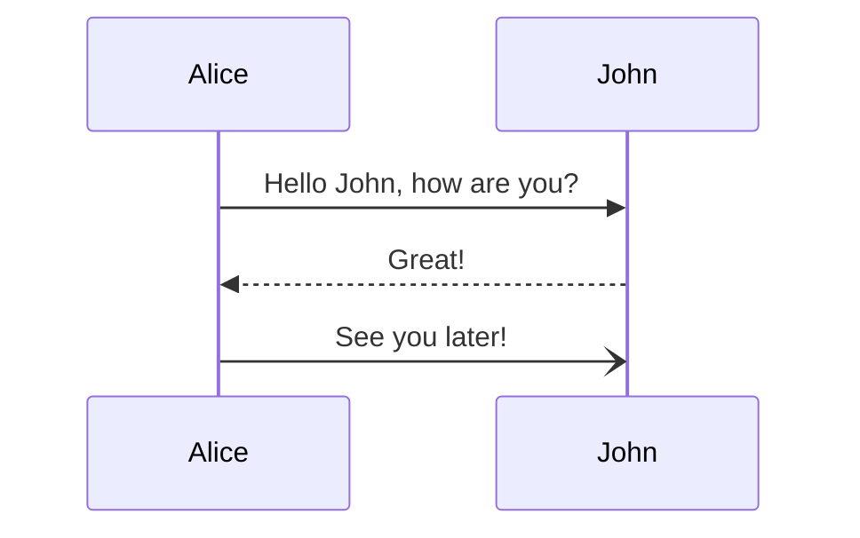

# DFA - Design first approach
[Webpage](https://coaxsoft.github.io/coax_dfa)

> Design first approach in software development is a methodology that emphasizes the importance of designing a software system before writing any code. This involves creating a comprehensive plan that outlines the system's architecture, components, and interfaces. The goal of the design first approach is to create a well-thought-out system that meets the needs of the users and is easy to maintain and extend.
>
> There are several benefits to using a design first approach, including:
> 
> * **Reduced rework:** By carefully planning the system before writing any code, developers can avoid having to rework their code later on. This can save a significant amount of time and money.
> * **Improved quality:** A well-designed system is more likely to be high-quality and bug-free. This is because the design process forces developers to think through all of the possible scenarios and how the system should behave in each case.
> * **Increased maintainability:** A well-designed system is easier to maintain and extend. This is because the design documents provide a clear roadmap for how the system works and how it can be modified.
> * **Improved communication:** The design process helps to improve communication between different stakeholders, such as developers, product managers, and users. This is because everyone is working towards a common goal, which is to create a system that meets the needs of the users.
> 
> The design first approach is often used in conjunction with other software development methodologies, such as agile development. In agile development, the design process is iterative and incremental, meaning that the design is updated as the system is developed. This allows the team to be flexible and respond to changes in requirements.
> 
> Here is a simplified overview of the design first approach:
> 1. **Gather requirements:** The first step is to gather requirements from the users and other stakeholders. This includes understanding the business goals of the system, the user needs, and the technical constraints.
> 2. **Create a high-level design:** Once the requirements have been gathered, the next step is to create a high-level design of the system. This design should outline the system's architecture, components, and interfaces.
> 3. **Create a detailed design:** Once the high-level design is complete, the next step is to create a detailed design of each component of the system. This design should include the component's internal structure, its interactions with other components, and its data model.
> 4. **Implement the design:** Once the detailed design is complete, the next step is to implement the design in code. This involves writing the code for each component of the system and integrating the components together.
> 5. **Test the system:** Once the system has been implemented, it is important to test it thoroughly to ensure that it meets the requirements and is free of bugs.
> The design first approach is a valuable tool for software developers. By carefully planning the system before writing any code, developers can save time and money, improve the quality of the system, and make it easier to maintain and extend. 

## DFA - COAX way 

Out DFA blueprint is composed of the following steps:
1. **Feature description**
    1. **1.1 Why?**
    1. **1.2 Goal**
    1. **1.3. Challenges / Risks**
1. **Non-functional requirements**
1. **Sequence Diagram**
1. **Actions**
1. **C4 Diagrams**
1. **Database structure**
1. **API documentation**
1. **Test coverage requirements**

Let's review it in details.

### 1. Feature description
#### 1.1. Why?
Describe the business reason for the feature. Why do we need it? What is the business value? What is the business problem we are trying to solve? Keep it short, without longreads.

#### 1.2. Goal
Describe the goal of the feature. What is the expected result? What is the expected outcome? What is the expected impact? Keep it short, without longreads.

#### 1.3. Challenges / Risks
Describe the challenges and risks of the feature. What are the possible blockers? What are the possible risks? What are the possible challenges?

### 2. Non-functional requirements
Technical goals that are not described in business requirements.
What could be the non-functional requirements?
- Performance
- Security
- Scalability
- Maintainability
- Reliability
- Usability
No need to describe each of them - only what really makes sense in scope of this feature.

The default assumption is that the feature is not changing the non-functional requirements.
Do not make it work slower or less secure in general!

### 3. Sequence Diagram
Describe the sequence of actions that are required to achieve the goal.
Use [Mermaid sequenceDiagram](https://mermaid.js.org/syntax/sequenceDiagram.html) syntax to describe the sequence of actions.
Write as many diagrams as needed to describe the flow.

Example:

### 4. Actions
What exact actions needs to be done to achieve the Goal. Describe what needs code units (classes, modules, functions, etc.) needs to be created or updated.
Try to give as detailed breakdown as possible. The more detailed the better. Consider the following example:
> - Create `MagicLinks::InvoicesController` - for payment links
> - Create `MagicLinks::Organizations::UsersController` - for organization users
> - Update URLs
> - In `MagicLinks::PaymentsController`
>   - Create page which generates payment link for the invoice
>   - Initiates Flywire script
>  - Flywire modal needs to be rendered

This description must be valid and understandable for the developer who is going to implement the feature (you don't know who).

### 5. C4 diagrams
Describe container and/or components. Use [C4 model](https://wiki.chervona-ruta.xyz/books/engineering-project-repository-documentation/page/uml-c4-description) to describe the architecture.
Describe those levels that make sense for the feature. If there are no architectural changes - no diagrams required.

P.S. Attach image of diagrams here. Put `.puml` them in the `.docs` folder.

### 6. Database structure

Describe the database structure changes. Use the following structure:

#### New
- add `my_new_column` to `my_table`
- ...

#### Changed
- rename `my_old_column` to `my_new_column` in `my_table`
- ...

#### Removed
- remove `my_old_column` from `my_table`
- ...

Consider to use [dbdiagram.io](https://dbdiagram.io/home) to describe database structure in text format.
Avoid "drawing" as much as possible. Use text format instead. If possible, describe required changes exactly in programming language/framework syntax, like migration files etc.

### 7. API documentation

Describe API changes. Use the following structure:

#### New
- add `GET my_resource/:id` endpoint

#### Changed
- rename `PATCH users/:id/update` to `PATCH users/:id`

#### Removed
- remove `DELTE posts/:id`

### 8. Test coverage requirements

Describe the test coverage requirements.
Default requirements: 
- NOT to reduce test coverage.
- 100% **endpoints** must be covered

_P.S. if feature description requires some more additional sections - feel free to add them.
For example you could add a **0. Glossary** section to describe some terms that are used in the feature description.
In some cases it could be useful to add a **9. Additional information** section to describe some additional information that is not covered by the previous sections._
