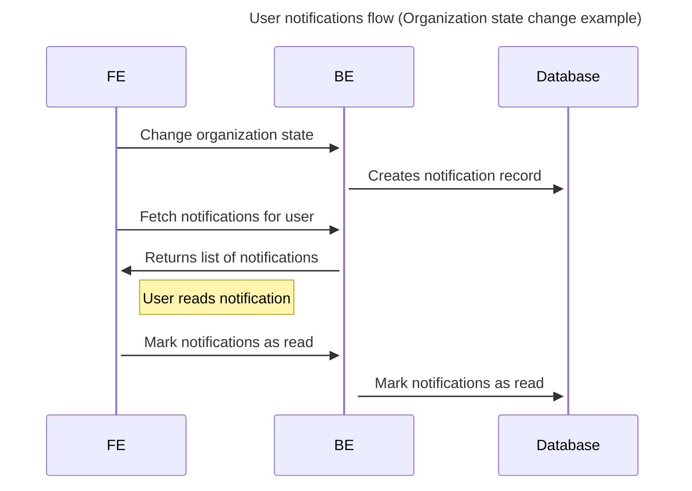

# Simple Notifications

## 1. Feature description
### 1.1 Why?
_Why we work on this_

We need to notify users about events in the system. To many events are happening.
Hard to track changes in the app, specially for the outfitters.

### 1.2 Goal

User can receive notifications about events in the system.

### 1.3 Actions

1. Use gem Noticed as a notification system
1. Add "notifications" table
1. Create a new notification class for each event
1. Add organization state change notifications
1. Add notifications endpoint for users
1. Add cache for this endpoint

## Take into a count!

- Deliver all notifications asynchronously (in background)

## 2. Non-functional requirements
_Technical goals that are not described in business requirements_

No requirements

## 3. Sequence Diagram



## 4. API documentation

### New

- `GET api/v1/users/:id/notifications`
- `PATCH api/v1/users/notifications/:id/mark_as_read`
- `GET api/customers/users/:id/notifications`
- `PATCH api/customers/users/notifications/:id/mark_as_read`

---

## 5. C4 diagrams
_Describe container and/or components_

No changes expected.

---

## 6. Database structure

### New 
#### Create notifications table
```dbml
Table notifications {
  id int [pk, increment]
  recipient_type varchar [not null]
  recipient_id bigint [not null]
  type varchar [not null]
  params jsonb
  read_at datetime
  created_at datetime [not null]
  updated_at datetime [not null]

  Indexes {
    (read_at)
    (recipient_type, recipient_id) [name: 'index_notifications_on_recipient']
  }
}
```

---

## 7. API documentation

Not yet.

## 8. Test coverage requirements

- 100% **endpoints** must be covered
- 100% **operations** must be covered
