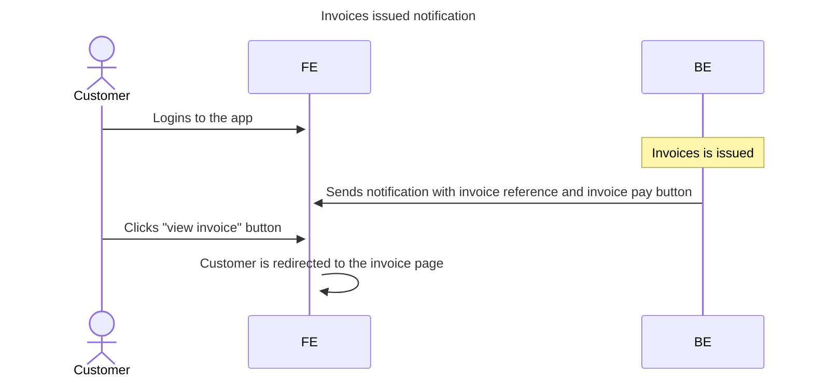

# Notification actions

## 1. Feature description
### 1.1 Why?
_Why it's necessary to do_

At the moment, app notifications are simple text. It's not really user-friendly and not informative enough.
It's necessary to add ability to include actions - links to some pages in the app.

### 1.2 Goal
_What exactly needs to be achieved_

- User is able to click one or more actions within notification

### 1.3. Challenges / Risks
_Obstacles that makes it difficult to achieve_

- All pages and actions are developed on React, but notifications are rendered on Rails.
- It's necessary to find a way to pass actions from Rails to React.
- Would be awesome to make this actions work in the emails as well - email to react url!.

## 2. Non-functional requirements
_Technical goals that are not described in business requirements_

- Frontend should be able to handle actions from Rails
- Frontend URL must not be hardcoded in Rails

--- 
## 3. Sequence Diagram

---

## 4. Actions
_What exact actions needs to be done to achieve the Goal_

The most suitable approach to achieve described goals is to include `record_type`, `record_id` inside the notification
and add the list of appropriate actions to the frontend. FE maps actions and `record_type`s to own pages.

- Rails should be able to pass `associated_record_type` and `associated_record_id` to Notification as well as available actions
- Create a list of available actions for each `associated_record_type` on BE
- Map list of available actions to urls on the frontend
- Create unified url on frontend to handle redirects from emails

- Add polymorphic `associated_record` to `notifications` table
- Review all notification create operations and add `associated_record` to them
- Add `associated_record` to notification serializer
  - add `record_type` and `record_id` to the serializer
- Add `available_actions` method to `Notification` model
  - use `params:jsonb` column to store available actions 
  - OR
  - fetch list of available actions from the associated record
- Create one entrypoint for all available actions for all records if possible, aka. yml file.
- Return it in metadata
- Add/update URLs in emails to use unified url

---

## 5. C4 diagrams
_Describe container and/or components_

No changes

---
## 6. Database structure

- Add polymorphic `associated_record` to `notifications` table as optional

---

## 7. API documentation

### Changed

- Updated `NotificationSerializer`

## 8. Test coverage requirements

- 100% **endpoints** must be covered
- 100% **operations** must be covered
