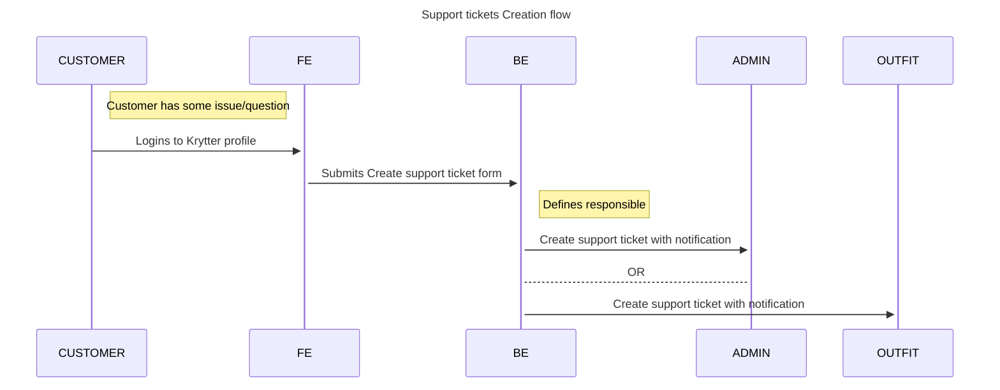
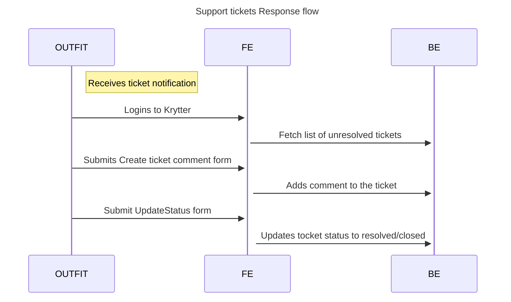

# Support section

## 1. Feature description
### 1.1 Why?
_Why it's necessary to do_

The application logic become really complicated and not always obvious. There are a lot of business cases, that could be
resolved only manually. Some legal edge-cases could be resolved only by support team. So, we need to provide a way to.

### 1.2 Goal
_What exactly needs to be achieved_

- Customer is able to write to support team
- Outfitter support team is able to answer/resolve tickets
- Customer support ticket could be resolved by Outfitter support team OR by Admin.
- Outfitter could create Support ticket for Admin

### 1.3. Challenges / Risks
_Obstacles that makes it difficult to achieve_

- This communication should be not only bi-directional, but admin could be also involved in a "conversation"

## 2. Non-functional requirements
_Technical goals that are not described in business requirements_

No requirements

--- 
## 3. Sequence Diagram





## 4. Actions
_What exact actions needs to be done to achieve the Goal_

- Create `SupportTicket` model
- Create `SupportTicketComment` model
- Add `SupportTicket::SUBJECTS_RESPONSIBILITY_MAPPING` - use to define who is responsible for each subject
   ```ruby
    {
      license: 'krytter',
      booking: 'outfitter',
      payment: 'outfitter',
      other: 'outfitter'
    }
    ```
- Add `SupportTickets::Operations::Create` operation
- Add `SupportTickets::Operations::UpdateStatus` operation
- Add `SupportTicketComments::Operations::Create` operation
- Add `Search::SupportTickets` class
- Add `Api::V1::Organizations::SupportTicketsController` class
  - index action
  - create action
  - update status action
  - Inherit `Api::Customers::Organizations::SupportTicketsController` class
- Add `Api::Customers::Organizations::SupportTickets::CommentsController` class
  - index action
  - Inherit `Api::Customers::Organizations::SupportTickets::CommentsController` class

---
## 5. C4 diagrams
_Describe container and/or components_

[PUML Class diagram](013_support_section/class_diagram.puml)

---
## 6. Database structure

New

```sql
Table support_tickets {
  id int [pk, increment]
  subject support_ticket_subjects
  description text
  status support_ticket_statuses
  user_id int [ref: > users.id]
  organization_id int [ref: > organizations.id]
  initiator support_ticket_responsibles
  responsible support_ticket_responsibles
}

Enum support_ticket_responsibles {
  outiftter
  krytter
}

Enum support_ticket_initiators {
  customer
  outiftter
}

Enum support_ticket_subjects {
  license
  booking
  payment
  other
}

Table SupportTicketComment {
  id int [pk, increment]
  body text
  support_ticket_id int [ref: > support_tickets.id]
  user_id int [ref: > users.id]
}

Enum support_ticket_statuses {
  open
  resolved
  closed
}
```

---

## 7. API documentation

### New

- `POST api/v1/organizations/:id/support_tickets`
  - `POST api/customers/organizations/:id/support_tickets`
- `GET api/v1/organizations/:id/support_tickets`
- `GET api/v1/organizations/support_tickets/:id`
- `PATCH api/v1/organizations/support_tickets/:id/status`
- `POST api/v1/organizations/support_tickets/:id/comments`
  - `POST api/customers/organizations/support_tickets/:id/comments`
- `GET api/v1/organizations/support_tickets/:id/comments`
- `GET api/v1/organizations/support_tickets/comments/:id`

